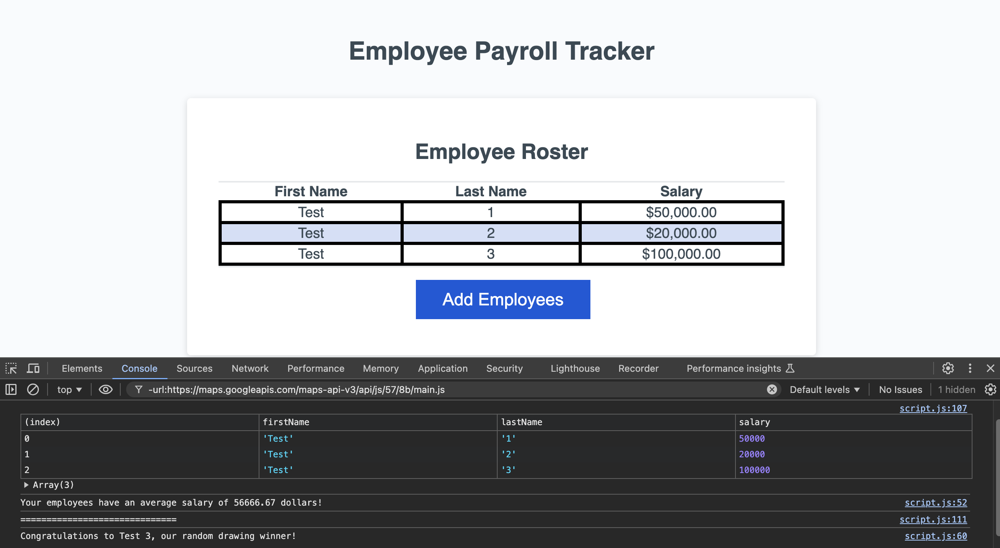

# Payroll Tracker



**Employee Payroll Tracker** is a web application that allows payroll managers to efficiently track and manage employee payroll data. The application provides functionalities to add employees, calculate average salaries, and randomly select an employee for recognition.

## Features

- **Add Employees:** Easily add new employees to the tracker with prompts for first name, last name, and salary.
- **Display Employee Roster:** View the complete list of employees sorted alphabetically by last name.
- **Calculate Average Salary:** Automatically computes and displays the average salary of all employees.
- **Random Employee Selection:** Conducts a random draw among employees to select a winner for recognition.

## Technologies Used

- **HTML:** Structure and content presentation.
- **CSS:** Styling and layout design.
- **JavaScript:** Logic implementation for employee management and calculations.
- **Git:** Version control for tracking changes and collaboration.
- **GitHub:** Hosting repository for codebase and version history.

## Installation

1. Clone the repository:

    ```bash
    git clone https://github.com/breannacamacho/payroll-tracker.git
    ```

2. Navigate to the project directory:

    ```bash
    cd payroll-tracker
    ```

3. Open `index.html` in your web browser to use the app.

## Usage

1. Click the "Add Employees" button to start adding employee data.
2. Enter the employee's first name, last name, and salary when prompted.
3. The added employee details will be displayed in a table format.
4. The average salary of all employees will be calculated and displayed.
5. A random employee will be selected for recognition.

## Contributing

Contributions are welcome! To contribute:

1. Fork the repository.
2. Create a new branch: `git checkout -b feature/YourFeature`
3. Commit your changes: `git commit -m 'Add some feature'`
4. Push to the branch: `git push origin feature/YourFeature`
5. Open a pull request.
